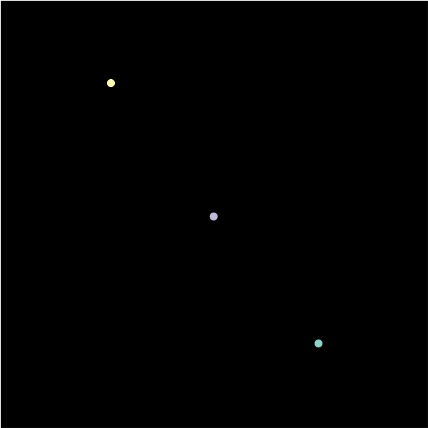

# Chenciner's Eight
Three body problem with stable solution proved by Chenciner and Montgomery in 2000 - [click here](https://arxiv.org/abs/math/0011268) to see full article.

Basically, initial conditions have to be exact. In cartesian coordinates they will take form:
Initial Positions | Initial Velocities
----------------- | ------------------
[0.97000436, -0.24308753] | [0.93240737, 0.86473146] / 2
[-0.97000436, 0.24308753] | [0.93240737, 0.86473146] / 2
[0, 0] | [-0.93240737, -0.86473146]

To calculate orbits Leap Frog algorithm was used.

Output will be multiple .png files. One can create .gif file out of them simply typing in terminal:` convert -delay 10 orbit-*.png orbit.gif ` to create `orbit.gif` file.

Note that you may need to install required packages.

Below is the .gif output of the code:

